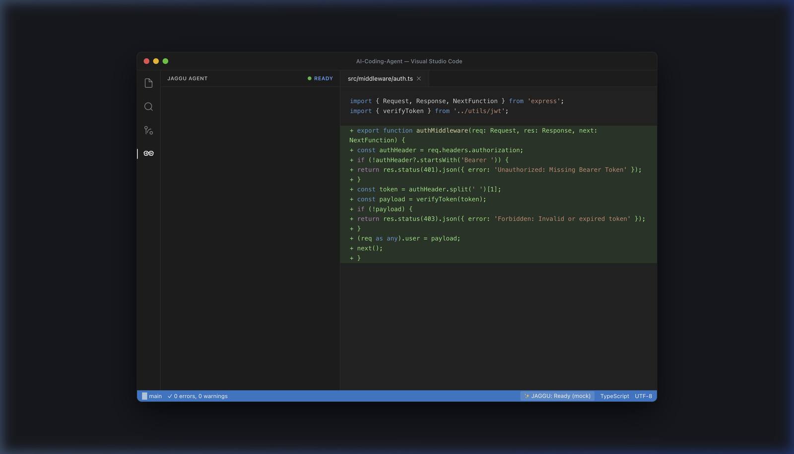
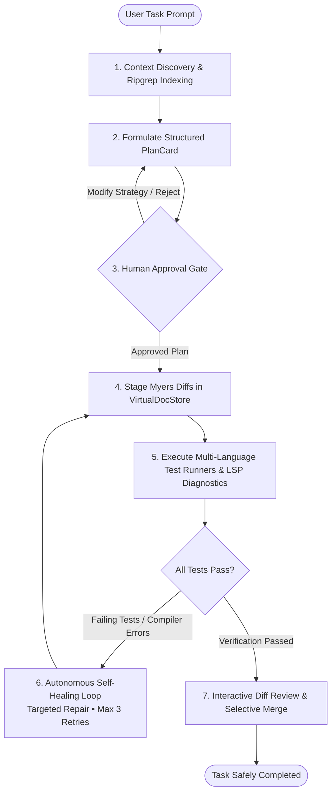

# JAGGU

<p align="center">
  
</p>

<h2 align="center">Developer-Controlled Autonomous AI Coding Agent for VS Code</h2>

<p align="center">
  <em>Plan precisely. Stage safely in shadow buffers. Verify with tests. Never surrender control.</em>
</p>

<p align="center">
  <code>TypeScript 5.7</code> &nbsp;|&nbsp;
  <code>React 18</code> &nbsp;|&nbsp;
  <code>VS Code API</code> &nbsp;|&nbsp;
  <code>Hugging Face Free Tier</code> &nbsp;|&nbsp;
  <code>Local Ollama / vLLM</code> &nbsp;|&nbsp;
  <code>Docker</code>
</p>

<p align="center">
  <a href="#-demo"></a>
  <a href="#-architecture-diagram"></a>
  <a href="#-quick-start-in-60-seconds"></a>
  <a href="#-install-extension"></a>
  <a href="#-supported-models--intelligent-routing"></a>
  <a href="#-scientific-evaluation-suite"></a>
</p>

<p align="center">
  <a href="https://code.visualstudio.com/"></a>
  <a href="https://www.typescriptlang.org/"></a>
  <a href="#-development--testing"></a>
  <a href="#-security--privacy-first"></a>
  <a href="#-supported-models--intelligent-routing"></a>
  <a href="LICENSE"></a>
</p>

---

## ⚡ Why JAGGU?

Most AI coding assistants force developers into one of two frustrating extremes:

1. **Dumb Chatbots**: Spit out markdown snippets that you must manually copy, paste, and diagnose when they break.
2. **Opaque Black-Box Agents**: Silently mutate workspace files on disk without warning, introducing subtle regressions and corrupting git histories.

**JAGGU delivers true autonomous engineering without sacrificing developer sovereignty.**

Built directly on the native VS Code extension runtime, JAGGU indexes your codebase with high-performance Ripgrep, synthesizes structured milestone execution plans, stages surgical diffs in an **in-memory shadow buffer (`VirtualDocStore`)**, executes your project's test runners to verify its solutions, and autonomously repairs compiler or test errors before presenting the finished work for your final approval.

### 🛡️ The 4-Pillar Foundation

```
 1. Transparent Planning ──► Formulates structured PlanCards before writing any code.
 2. Shadow Staging       ──► Staged in-memory with Myers diff. Zero direct disk overwrites.
 3. Empirical Proof      ──► Auto-runs tests & LSP compiler diagnostics with self-healing.
 4. Developer Sovereignty ──► Granular per-file Accept / Reject gates & side-by-side diffs.
```

> [!NOTE]
> **Zero Middleman Proxy** • **Free-First Default** • **100% Direct TLS Connections** • **Air-Gapped Local Model Support** • **Optional Enterprise Gateway**

---

## 🎬 Demo

<p align="center">
  
</p>

<p align="center">
  <em>Above: JAGGU's live interactive sidebar in VS Code alongside typed Webview-to-Extension RPC definitions (<a href="packages/jaggu-ui/src/types/rpc.ts"><code>packages/jaggu-ui/src/types/rpc.ts</code></a>).</em>
</p>

### 🔍 Tour of the Live Interface

| Component                          | What You See                                                                                                                   | Technical Underpinning                                                            |
| :--------------------------------- | :----------------------------------------------------------------------------------------------------------------------------- | :-------------------------------------------------------------------------------- |
| **⚡ Instant Action Starters**     | Quick prompts: _Explain this project_, _Plan a new feature_, _Diagnose compiler & test errors_, _Run tests & verify workspace_ | Synthesizes immediate contextual tasks without typing                             |
| **🔍 Semantic Context Docking**    | `@workspace` chip in the floating prompt box                                                                                   | Ripgrep index + AST repo map contextualized via `@jaggu/core`                     |
| **🤖 Polymorphic Model Selector**  | Live model selector pill (`● GPT-4o (Omni) [PAID]`)                                                                            | Direct client-side routing across Hugging Face, Ollama, OpenAI, Anthropic, Gemini |
| **🎙️ Hands-Free Voice Typing**     | Microphone dictation button in the action dock                                                                                 | Integrated speech-to-text input for frictionless prompting                        |
| **💻 Execution & Terminal Drawer** | Collapsible `>_ Terminal / Execution` drawer                                                                                   | Real-time streaming command output, test logs, and step-by-step agent telemetry   |
| **🛡️ Strongly-Typed RPC Bridge**   | Active editor showing `WebviewToExtensionMessage` in `rpc.ts`                                                                  | Type-safe JSON-RPC IPC bridge between React 18 Webview and Extension Host         |

---

## 🚀 Quick Start in 60 Seconds

### Step 1: Install the Extension

Install the pre-built, self-contained `.vsix` package:

```bash
code --install-extension packages/jaggu-vscode/jaggu-vscode-0.1.0.vsix
```

_(Or install via VS Code UI: `Cmd+Shift+P` / `Ctrl+Shift+P` ➔ **`Extensions: Install from VSIX...`** ➔ select the file)._

### Step 2: Open the JAGGU Sidebar

Click the **JAGGU glasses icon** in the VS Code Activity Bar on the left, or press `Cmd+Shift+P` and execute:

```
JAGGU: Open Chat
```

### Step 3: Choose Your Model (Zero-Config or Cloud)

- **Free-First Default (Hugging Face)**: Connect your free Hugging Face token when prompted, or leave Model on `Auto`.
- **100% Offline / Local (Ollama)**: Ensure Ollama is running (`ollama serve`), select `ollama` as your provider. No API keys or internet connection required!
- **Commercial Cloud (OpenAI / Anthropic / Gemini)**: Run `JAGGU: Manage API Keys (SecretStorage)` from the Command Palette to store keys securely in your OS Keychain.

### Step 4: Submit a Task

Use the quick starter buttons or type a natural language prompt:

> _"Fix the clock skew error in the JWT auth middleware, verify with test suite, and stage the diff."_

### Step 5: Review & Merge

1. Review the milestone **PlanCard** and click **Approve**.
2. Watch JAGGU autonomously stage edits, run tests, and self-heal diagnostics.
3. Inspect the Myers diffs side-by-side in VS Code's native diff editor.
4. Selectively **Accept** or **Reject** files individually.

---

## 🏛️ Architecture Diagram

JAGGU uses a modular, event-driven multi-layer architecture designed for maximum performance, security, and developer control:

```
┌────────────────────────────────────────────────────────────────────────────────────────┐
│                                   Visual Studio Code                                   │
│  ┌──────────────────────────────────────────────────┐  ┌────────────────────────────┐  │
│  │         Sidebar Webview (React 18 + Vite)        │  │     Native Diff Editor     │  │
│  │  • Interactive PlanCard   • Selective Approval   │  │  • Side-by-side Myers diff │  │
│  │  • Model Selector Dock    • Voice Typing         │  │  • Staged virtual buffer   │  │
│  └──────────────────────────┬───────────────────────┘  └─────────────┬──────────────┘  │
└─────────────────────────────┼────────────────────────────────────────┼─────────────────┘
                              │ Bidirectional Typed RPC IPC            │
┌─────────────────────────────▼────────────────────────────────────────▼─────────────────┐
│                                JAGGU Extension Host                                    │
│  ┌───────────────────────┐  ┌────────────────────────┐  ┌───────────────────────────┐  │
│  │   SidebarProvider     │  │  SecretStorage (Keys)  │  │ VirtualDocProvider (Diff) │  │
│  └───────────────────────┘  └────────────────────────┘  └───────────────────────────┘  │
└──────────────────────────────────────────┬─────────────────────────────────────────────┘
                                           │
┌──────────────────────────────────────────▼─────────────────────────────────────────────┐
│                           Agent Orchestrator (@jaggu/core)                             │
│                  Deterministic 7-State Finite State Machine (FSM)                      │
│  ┌─────────────────────────────────┐   ┌────────────────────────────────────────────┐  │
│  │         Context Engine          │   │            Verification Engine             │  │
│  │  • Ripgrep semantic search      │   │  • Multi-runner execution (Vitest/Jest/py) │  │
│  │  • AST RepoMap extraction       │   │  • LSP compiler diagnostic analyzer        │  │
│  └─────────────────────────────────┘   └────────────────────────────────────────────┘  │
│  ┌──────────────────────────────────────────────────────────────────────────────────┐  │
│  │                          Tool & Diff Execution Engine                            │  │
│  │  • ReadFile  • ProposeEdit  • ApplyEdit  • VirtualDocStore  • GitSafetyCheckpoints│  │
│  └──────────────────────────────────────────────────────────────────────────────────┘  │
└──────────────────────────────────────────┬─────────────────────────────────────────────┘
                                           │
           ┌───────────────────────────────┴───────────────────────────────┐
           │ Direct TLS Client Connections OR Optional Enterprise Gateway  │
           │           (packages/jaggu-server • Docker Compose)            │
           ▼                                                               ▼
┌──────────────────────────────────────┐       ┌─────────────────────────────────────────┐
│        Polymorphic Cloud APIs        │       │       Air-Gapped & Local Inference      │
│  • Anthropic (Claude 3.7 / 3.5)      │       │  • Ollama (Qwen2.5-Coder, DeepSeek-R1)  │
│  • OpenAI (GPT-4o, o3-mini)          │       │  • OpenAI-Compatible (vLLM, LM Studio)  │
│  • Google Gemini (2.0 Flash / Pro)   │       │  • Hugging Face Free Inference API      │
└──────────────────────────────────────┘       └─────────────────────────────────────────┘
```

### 🔄 The 7-State Execution Loop



---

## ✨ Key Features & Capabilities

| Capability                       | What It Does                                                                                                                         | Technical Implementation                                       | Why It Matters                                                                         |
| :------------------------------- | :----------------------------------------------------------------------------------------------------------------------------------- | :------------------------------------------------------------- | :------------------------------------------------------------------------------------- |
| 🛡️ **Controlled Autonomy**       | Deterministic 7-state Finite State Machine (`IDLE` ➔ `PLANNING` ➔ `APPROVAL` ➔ `EXECUTING` ➔ `VERIFYING` ➔ `SELF-HEAL` ➔ `COMPLETE`) | State transition guards in `@jaggu/core`                       | Eliminates infinite loops and unexpected background operations. Fully observable.      |
| 📋 **Interactive PlanCards**     | Generates milestone-driven execution blueprints                                                                                      | Schema-validated plan formulation                              | Developer approves or amends the strategy before any code is staged.                   |
| 🪟 **Shadow Buffer Diffs**       | Staged in an in-memory `VirtualDocStore`                                                                                             | Custom VS Code `TextDocumentContentProvider` (`jaggu-diff://`) | Zero risk of disk corruption. Inspect side-by-side using VS Code's native diff viewer. |
| 📁 **Selective File Approval**   | Granular per-file Accept / Reject gates                                                                                              | Atomic changeset staging and rollback                          | Retain full editorial authority. Accept good changes, reject unwanted files.           |
| 🔄 **Empirical Verification**    | Auto-detects & executes test runners                                                                                                 | Jest, Vitest, PyTest, Go test, Cargo test auto-detection       | The agent refuses to declare success without passing empirical test suites.            |
| 🩹 **Autonomous Self-Healing**   | Diagnoses exit codes, stderr & LSP diagnostics                                                                                       | 3-cycle feedback repair loop with compiler error injection     | Fixes minor typos, missed imports, and test failures automatically.                    |
| 🔒 **Git Safety Checkpoints**    | Non-destructive working tree safety stashes                                                                                          | Ephemeral git stash checkpoints                                | Protects unstaged work and provides instant rollback points without touching remotes.  |
| 🎙️ **Voice Typing Dictation**    | Hands-free natural speech task entry                                                                                                 | Native browser Web Speech API bridge in Webview                | Fast, frictionless task submission while coding.                                       |
| 🌐 **Multi-Provider & Local AI** | Works with Claude 3.7, GPT-4o, Gemini 2.0, Hugging Face, Ollama, & vLLM                                                              | Direct client TLS + polymorphic gateway                        | Freedom from vendor lock-in. 100% offline and air-gapped capability.                   |
| 🏢 **Enterprise Proxy Option**   | Optional backend proxy server & container                                                                                            | Express/TS gateway (`@jaggu/server`) + Docker Compose          | Centralized enterprise key management, rate-limiting, and network isolation.           |

---

## 🤖 Supported Models & Intelligent Routing

JAGGU communicates directly with AI providers using **zero intermediary telemetry relays**:

| Provider              | Provider ID         | Highlighted Models                                                     | Tier            | Connection / Privacy                      |
| :-------------------- | :------------------ | :--------------------------------------------------------------------- | :-------------- | :---------------------------------------- |
| **Local Ollama**      | `ollama`            | `qwen2.5-coder:7b`, `deepseek-r1:14b`, `llama3.3:8b`                   | **Free**        | **100% Offline / Air-Gapped**             |
| **Hugging Face**      | `huggingface`       | `Qwen/Qwen2.5-Coder-32B-Instruct`, `meta-llama/Llama-3.3-70B-Instruct` | **Free**        | Direct Client TLS (Free User Token)       |
| **OpenAI-Compatible** | `openai-compatible` | Any self-hosted model (vLLM, LM Studio, LocalAI)                       | **Free/Custom** | Local Network / Private VPC               |
| **Anthropic**         | `anthropic`         | `claude-3-7-sonnet-latest`, `claude-3-5-sonnet-latest`                 | Paid            | Direct Client TLS (Encrypted)             |
| **OpenAI**            | `openai`            | `gpt-4o`, `gpt-4o-mini`, `o1`, `o3-mini`                               | Paid            | Direct Client TLS (Encrypted)             |
| **Google Gemini**     | `gemini`            | `gemini-2.0-flash`, `gemini-2.0-pro-exp`, `gemini-1.5-pro`             | Free / Paid     | Direct Client TLS (Encrypted)             |
| **Mock Engine**       | `mock`              | `mock-fast`, `mock-accurate`                                           | Built-in        | In-memory simulated for zero-cost testing |

### 🧭 Smart "Auto" Model Routing Logic

When Model is set to **`Auto`**, JAGGU dynamically prioritizes zero-cost and local resources before falling back to commercial APIs:

```
[User Task] ──► Check Hugging Face Free Tier (Ready?) ──► Route to Free Cloud LLM
                     │ (Rate-limited or Unavailable)
                     ▼
                 Check Ollama Local Server (Running?) ──► Route to Local GPU/CPU
                     │ (Ollama not running)
                     ▼
                 Check Configured Cloud Provider ───────► Route to Claude / GPT / Gemini
```

---

## 📦 Install Extension

### Option A: Command Line Install

```bash
code --install-extension packages/jaggu-vscode/jaggu-vscode-0.1.0.vsix
```

### Option B: VS Code UI Install

1. Open VS Code.
2. Press `Cmd+Shift+P` (macOS) or `Ctrl+Shift+P` (Windows/Linux).
3. Type **`Extensions: Install from VSIX...`** and hit Enter.
4. Select `packages/jaggu-vscode/jaggu-vscode-0.1.0.vsix`.

### Package Verification

| Attribute            | Details                                                                                          |
| :------------------- | :----------------------------------------------------------------------------------------------- |
| **Artifact Path**    | [`packages/jaggu-vscode/jaggu-vscode-0.1.0.vsix`](packages/jaggu-vscode/jaggu-vscode-0.1.0.vsix) |
| **Package Size**     | ~1.1 MB (Self-contained, zero external runtime dependencies)                                     |
| **Included Bundles** | Bundled CJS extension host, minified Webview IIFE, icons, manifest, license                      |
| **Target VS Code**   | `^1.90.0` or higher                                                                              |

To recompile or package the VSIX from source:

```bash
npm run package:extension
```

---

## ⌨️ VS Code Commands

Access all JAGGU functions directly via the Command Palette (`Cmd+Shift+P` / `Ctrl+Shift+P`):

| Command                                  | Identifier             | Action                                                                |
| :--------------------------------------- | :--------------------- | :-------------------------------------------------------------------- |
| `JAGGU: Open Chat`                       | `jaggu.openChat`       | Focuses and opens the JAGGU sidebar panel                             |
| `JAGGU: Start New Session`               | `jaggu.startSession`   | Resets conversation state and initializes a clean task session        |
| `JAGGU: Cancel Active Task`              | `jaggu.cancelSession`  | Instantly aborts in-flight generation, streaming, or test execution   |
| `JAGGU: Manage API Keys (SecretStorage)` | `jaggu.setApiKey`      | Securely stores provider API keys in OS Keychain / Credential Manager |
| `JAGGU: Select Model Provider`           | `jaggu.selectProvider` | Quickly switches active AI provider (Ollama, Anthropic, OpenAI, etc.) |
| `JAGGU: Select Active Model`             | `jaggu.selectModel`    | Selects specific model tag or enters custom model string              |

---

## 🛡️ Security & Privacy First

JAGGU is built under a strict defense-in-depth model:

- 🔐 **OS-Level Secret Storage**: API keys are saved exclusively into VS Code's `SecretStorage` API (macOS Keychain, Windows Credential Manager, or Linux Secret Service). Never stored in plaintext files, workspace settings, or telemetry.
- 🧹 **Secret Sanitizer Regex Pipeline**: Built-in sanitization scrubs API tokens, bearer headers, and private keys from debug logs, telemetry, and error messages.
- 🛑 **In-Memory Shadow Sandboxing**: The agent cannot execute destructive writes directly to disk; all diffs reside in memory (`VirtualDocStore`) until explicitly approved.
- 🔒 **Strict Directory Traversal Guards**: Path resolution strictly prevents directory traversal (`/../`) attacks beyond the active project folder.
- 🛡️ **Zero Telemetry Exfiltration**: Code, prompts, and tokens are never sent to third-party analytics or intermediary relays.
- 🌐 **Air-Gapped Local Inference**: Fully functional in completely offline environments using local Ollama or vLLM.

---

## 📦 Monorepo Architecture

JAGGU is structured as a clean, highly modular TypeScript monorepo with 5 dedicated workspaces:

```
Coding Agent/
├── packages/
│   ├── jaggu-core/       # Pure TypeScript agent engine & orchestration
│   │   ├── src/agent/        # 7-state Finite State Machine (FSM)
│   │   ├── src/context/      # Ripgrep indexing & AST context discovery
│   │   ├── src/diff/         # VirtualDocStore shadow buffer & Myers diff
│   │   ├── src/models/       # Polymorphic Model Gateway (Claude, GPT, Gemini, Ollama, HF)
│   │   ├── src/planning/     # Structured PlanCard synthesis & validation
│   │   ├── src/tools/        # Workspace tools (read, write, search, tests)
│   │   └── src/verification/ # Multi-language test executor & LSP diagnostic analyzer
│   │
│   ├── jaggu-ui/         # React 18 Webview interface (Vite + CSS)
│   │   ├── src/components/   # PlanCard, ApprovalCard, DiffPreview, ModelSelector
│   │   ├── src/types/        # Strongly-typed RPC definitions (rpc.ts)
│   │   └── src/App.tsx       # Bidirectional event bridge with extension host
│   │
│   ├── jaggu-vscode/     # VS Code extension host adapter
│   │   ├── src/extension.ts          # Lifecycle management & command dispatch
│   │   ├── src/sidebarProvider.ts    # Webview provider & agent host bridge
│   │   └── src/credentials.ts        # SecretStorage credential manager
│   │
│   ├── jaggu-server/     # Optional enterprise proxy gateway & key manager
│   │   ├── src/index.ts              # Express/TS streaming proxy with healthchecks
│   │   └── Dockerfile                # Standalone container deployment
│   │
│   └── jaggu-eval/       # Empirical benchmarking harness
│       ├── fixtures/         # 12 isolated software engineering test sandboxes
│       └── src/evaluator.ts  # Deterministic test harness & scoring engine
│
├── docker-compose.yml    # Containerized orchestration for jaggu-server
└── docs/                 # Architecture specifications, PRDs, ADRs & runbooks
```

---

## 🧪 Scientific Evaluation Suite

JAGGU includes `@jaggu/eval`, an automated benchmarking suite inspired by SWE-bench, rigorously evaluating the agent across **12 software engineering archetypes**:

1. **Feature Implementation**: Token bucket rate limiting with sliding window
2. **Bug Diagnosis**: Clock skew tolerance in JWT expiration
3. **Architectural Refactoring**: Decoupling database repositories from business logic
4. **Test Generation**: High-coverage boundary and edge-case test synthesis
5. **Compiler Recovery**: Diagnostic analysis and repair of TypeScript type errors
6. **Concurrency & Race Conditions**: Thread-safe worker pool synchronization
7. **Security Vulnerability Remediation**: Directory traversal patching (`/../`)
8. **Git Safety & Working Tree**: Unstaged developer modification preservation
9. **API Backward Compatibility**: Non-breaking contract expansion
10. **Error Propagation**: Graceful handling of network and filesystem faults
11. **Performance Optimization**: N+1 query elimination and caching
12. **State Machine Invariants**: Verification of illegal state transitions

To run the evaluation suite:

```bash
npm run eval --workspace=@jaggu/eval
```

---

## 🛠️ Development & Testing

```bash
# Type check all packages
npm run typecheck

# Run linter across all workspaces
npm run lint

# Run all 39 test suites (260 unit & integration tests)
npm test

# Package standalone .vsix extension
npm run package:extension

# Run optional enterprise backend proxy server
npm run server:dev

# Or launch containerized proxy server via Docker
docker compose up -d
```

---

## 📚 Deep-Dive Documentation

Explore in-depth architectural specifications, security reviews, and engineering runbooks:

- [System Architecture](docs/06-system-architecture.md)
- [Agent State Machine Specification](docs/07-agent-architecture.md)
- [Context Retrieval Engine](docs/10-context-engine.md)
- [Model Routing Architecture & Auto Mode](docs/MODEL_ROUTING.md)
- [Hugging Face Free-First Provider Guide](docs/HUGGINGFACE_PROVIDER.md)
- [Offline Local Inference with Ollama](docs/OFFLINE_OLLAMA.md)
- [Trust & Security Architecture](docs/TRUST_AND_SECURITY.md)
- [Threat Model & Risk Matrix](docs/THREAT_MODEL.md)
- [Production Security Audit Report](docs/PRODUCTION_SECURITY_REPORT.md)
- [Production Readiness Report](docs/PRODUCTION_READINESS_REPORT.md)
- [Production Operational Runbook](docs/PRODUCTION_RUNBOOK.md)
- [Incident Response Plan](docs/INCIDENT_RESPONSE.md)
- [Architecture Decision Records (ADRs)](docs/adr/)
- [Security Policy](SECURITY.md)

---

## 📄 License

This project is licensed under the **MIT License** — see the [LICENSE](LICENSE) file for details.
