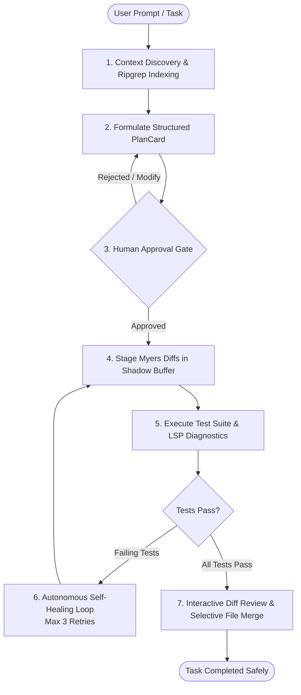

# JAGGU ⚡

<p align="center">
  
</p>

<p align="center">
  <strong>The Developer-Controlled Autonomous AI Coding Agent for VS Code</strong><br>
  <em>Plan precisely. Stage safely. Verify with tests. Never surrender control.</em>
</p>

<p align="center">
  <a href="https://code.visualstudio.com/"></a>
  <a href="https://www.typescriptlang.org/"></a>
  <a href="#-development--testing"></a>
  <a href="#-security--privacy-first"></a>
  <a href="LICENSE"></a>
</p>

<p align="center">
  <a href="#-quick-start">Quick Start</a> •
  <a href="#-why-jaggu">Why JAGGU?</a> •
  <a href="#-how-it-works">How It Works</a> •
  <a href="#-vs-code-commands">Commands</a> •
  <a href="#-supported-models--providers">Models</a> •
  <a href="#-monorepo-architecture">Architecture</a> •
  <a href="#-scientific-evaluation-suite">Benchmarks</a>
</p>

---

## ⚡ Overview

Most AI coding assistants either output code snippets to a chat window for you to manually copy-paste, or silently modify your workspace files with opaque, unpredictable changes.

**JAGGU delivers true autonomous engineering without sacrificing developer control.**

Built directly on the VS Code extension runtime, JAGGU indexes your codebase with Ripgrep, synthesizes structured multi-phase execution plans, stages surgical diffs in an **in-memory shadow buffer**, runs your project's test suites to verify its solutions, and autonomously repairs compiler or test errors before presenting the finished work for your final approval.

> **Zero Middleman Proxy** • **100% Direct TLS Connections** • **Air-Gapped Local Model Support**

---

## ✨ Key Features

| Capability | What It Does | Why It Matters |
| :--- | :--- | :--- |
| 🛡️ **Controlled Autonomy** | Deterministic 7-state Finite State Machine (`IDLE` ➔ `PLANNING` ➔ `APPROVAL` ➔ `EXECUTING` ➔ `VERIFYING` ➔ `SELF-HEAL` ➔ `COMPLETE`) | No runaway loops or silent background file corruption. Every transition is transparent and observable. |
| 📋 **Interactive PlanCards** | Generates structured, milestone-based execution plans | Review and approve the agent's strategy before a single line of code is staged. |
| 🪟 **Shadow Buffer Diffs** | Edits staged in an in-memory `VirtualDocStore` | Zero direct file overwrites. Inspect changes side-by-side using VS Code's native diff editor. |
| 📁 **Selective File Approval** | Granular per-file Accept / Reject gates | Approve only the files you want, reject unwanted changes, or iterate on the diff before committing. |
| 🔄 **Automated Test Verification** | Auto-detects & runs test runners (Jest, Vitest, PyTest, Go, Cargo) | The agent never marks a task finished without empirical test proof. |
| 🩹 **Self-Healing Loop** | Catches exit codes, stderr & LSP compiler diagnostics | Automatically attempts up to 3 targeted repairs if tests fail or syntax errors arise. |
| 🔒 **Git Safety Checkpoints** | Non-destructive working tree safety stashes | Protects unstaged work and provides instant rollback points. Never pushes to remote. |
| 🌐 **Provider Agnostic & Local AI** | Native support for Claude 3.5/3.7, GPT-4o, Gemini 2.0, Hugging Face, Ollama, & vLLM | Complete independence from vendor lock-in. Run 100% offline and air-gapped with zero telemetry. |

---

## 🔄 How It Works

JAGGU executes an observable, closed-loop software engineering workflow:



---

## 🚀 Quick Start

### Prerequisites
- **Node.js**: `v20.x` or later
- **npm**: `v10.x` or later
- **VS Code**: `v1.90.0` or later
- *(Optional)* **Ollama**: For 100% offline, local model execution

### Option A: Install Packaged Extension (`.vsix`)

If you have downloaded or built `jaggu-vscode-0.1.0.vsix`:

```bash
code --install-extension packages/jaggu-vscode/jaggu-vscode-0.1.0.vsix
```
*Or in VS Code:* Press `Cmd+Shift+P` (macOS) / `Ctrl+Shift+P` (Windows/Linux) ➔ type **Extensions: Install from VSIX...** ➔ select the file.

### Option B: Build & Run from Source

```bash
# 1. Clone the repository
git clone https://github.com/jaggureddy11/AI-Coding-Agent.git
cd AI-Coding-Agent

# 2. Install workspace dependencies
npm install

# 3. Build all packages
npm run build

# 4. Open in VS Code & launch Extension Host
code .
# Press F5 to start debugging in an Extension Development Host window
```

---

## 🎮 Using JAGGU

1. **Open the Sidebar**: Click the **JAGGU coding glasses icon** in the Activity Bar (or run `JAGGU: Open Chat`).
2. **Configure Your Provider**:
   - **Local AI (Ollama)**: Ensure Ollama is running (`ollama serve`). Select `ollama` as your provider and type your model (e.g. `qwen2.5-coder:7b`). No API key needed!
   - **Cloud Models**: Run `JAGGU: Manage API Keys (SecretStorage)` from the Command Palette, pick your provider, and paste your API key.
3. **Submit a Task**: Type your request (e.g. *"Fix the clock skew error in the JWT auth middleware and add regression tests"*).
4. **Approve the Plan**: Review the milestone PlanCard and click **Approve**.
5. **Inspect Diffs & Review**: Check the staged changes in VS Code's side-by-side diff viewer and accept or reject files individually.

---

## ⌨️ VS Code Commands

Access all JAGGU capabilities directly via the Command Palette (`Cmd+Shift+P` / `Ctrl+Shift+P`):

| Command | Identifier | Action |
| :--- | :--- | :--- |
| `JAGGU: Open Chat` | `jaggu.openChat` | Focuses and opens the JAGGU sidebar view |
| `JAGGU: Start New Session` | `jaggu.startSession` | Resets conversation state and initializes a clean task session |
| `JAGGU: Cancel Active Task` | `jaggu.cancelSession` | Instantly aborts in-flight generation, streaming, or test execution |
| `JAGGU: Manage API Keys (SecretStorage)` | `jaggu.setApiKey` | Securely stores API keys in OS Keychain / Credential Manager |
| `JAGGU: Select Model Provider` | `jaggu.selectProvider` | Quickly switches active AI provider (Ollama, Anthropic, OpenAI, etc.) |
| `JAGGU: Select Active Model` | `jaggu.selectModel` | Selects specific model tag or enters custom model string |

---

## 🤖 Supported Models & Providers

JAGGU connects directly to AI providers with **zero intermediate proxy servers**:

| Provider | Provider ID | Highlighted Models | Privacy / Connection |
| :--- | :--- | :--- | :--- |
| **Local Ollama** | `ollama` | `qwen2.5-coder:7b`, `deepseek-r1:14b`, `llama3.3:8b` | **100% Offline / Air-Gapped** |
| **OpenAI-Compatible** | `openai-compatible` | Any self-hosted model (vLLM, LM Studio, LocalAI) | Local / Private Network |
| **Anthropic** | `anthropic` | `claude-3-7-sonnet-latest`, `claude-3-5-sonnet-latest` | Direct Client-to-API TLS |
| **OpenAI** | `openai` | `gpt-4o`, `gpt-4o-mini`, `o1`, `o3-mini` | Direct Client-to-API TLS |
| **Google Gemini** | `gemini` | `gemini-2.0-flash`, `gemini-2.0-pro-exp`, `gemini-1.5-pro` | Direct Client-to-API TLS |
| **Hugging Face** | `huggingface` | `Qwen/Qwen2.5-Coder-32B-Instruct`, `meta-llama/Llama-3.3-70B` | Direct Client-to-API TLS |
| **Mock Engine** | `mock` | `mock-fast`, `mock-accurate` | In-memory simulated for testing |

---

## 🛡️ Security & Privacy First

- 🔐 **OS-Level Secret Storage**: API keys are saved exclusively into VS Code's `SecretStorage` API (backed by macOS Keychain, Windows Credential Manager, or Linux Secret Service). Never saved to plain text or settings files.
- 🧹 **Secret Sanitizer**: Built-in regex sanitization strips API keys, tokens, and sensitive headers from debug logs and error messages.
- 🛡️ **Zero Telemetry Exfiltration**: Code, prompts, and tokens are never sent to third-party analytics or intermediary relays.
- 🛑 **Shadow Staging Protection**: The agent cannot execute destructive writes directly to your disk; all diffs reside in memory until explicitly accepted.
- 🔒 **Workspace Confinement**: Path resolution strictly prevents directory traversal (`/../`) attacks beyond the active project folder.

---

## 📦 Monorepo Architecture

JAGGU is built as an extensible TypeScript monorepo with clean separation of concerns:

```
AI-Coding-Agent/
├── packages/
│   ├── jaggu-core/       # Pure TypeScript agent engine & orchestration
│   │   ├── src/agent/        # 7-state Finite State Machine (FSM)
│   │   ├── src/context/      # Ripgrep indexing & AST context discovery
│   │   ├── src/diff/         # VirtualDocStore shadow buffer & Myers diff
│   │   ├── src/models/       # Model Gateway (Claude, GPT, Gemini, Ollama)
│   │   ├── src/planning/     # Structured PlanCard synthesis & validation
│   │   ├── src/tools/        # Workspace tools (read, write, search, tests)
│   │   └── src/verification/ # Test runner executor & LSP diagnostic analyzer
│   │
│   ├── jaggu-ui/         # React 18 Webview interface
│   │   ├── src/components/   # PlanCard, ApprovalCard, DiffPreview, ModelSelector
│   │   └── src/App.tsx       # Bidirectional RPC bridge with extension host
│   │
│   ├── jaggu-vscode/     # VS Code extension host adapter
│   │   ├── src/extension.ts          # Lifecycle management & command dispatch
│   │   ├── src/sidebarProvider.ts    # Webview provider & agent host bridge
│   │   └── src/credentials.ts        # SecretStorage credential manager
│   │
│   └── jaggu-eval/       # Empirical benchmarking harness
│       ├── fixtures/         # 12 isolated software engineering test sandboxes
│       └── src/evaluator.ts  # Deterministic test harness & scoring engine
│
└── docs/                 # Architecture specifications, PRDs & ADRs
```

---

## 🧪 Scientific Evaluation Suite

JAGGU includes `@jaggu/eval`, an automated benchmarking suite inspired by SWE-bench, evaluating the agent across **12 realistic software engineering archetypes**:

- **Feature Implementation**: Token bucket rate limiting with sliding window
- **Bug Diagnosis**: Clock skew tolerance in JWT expiration
- **Architectural Refactoring**: Decoupling database repositories from business logic
- **Test Generation**: High-coverage boundary and edge-case test synthesis
- **Compiler Recovery**: Diagnostic analysis and repair of TypeScript type errors
- **Concurrency & Race Conditions**: Thread-safe worker pool synchronization
- **Security Vulnerability Remediation**: Directory traversal patching (`/../`)
- **Git Safety & Working Tree**: Unstaged developer modification preservation

To run the evaluation suite:
```bash
npm run eval --workspace=@jaggu/eval
```

---

## 🛠️ Development & Testing

```bash
# Type check all packages
npm run typecheck

# Run linter across all workspaces
npm run lint

# Run all 31 unit & integration test suites
npm test

# Package standalone .vsix extension
npm run package:extension
```

---

## 📚 Documentation

Deep-dive architectural documentation is available in the [`docs/`](docs/) directory:

- [System Architecture](docs/06-system-architecture.md)
- [Agent State Machine Specification](docs/07-agent-architecture.md)
- [Context Retrieval Engine](docs/10-context-engine.md)
- [Security & Permission Architecture](docs/09-security-and-permissions.md)
- [Marketplace Release Checklist](docs/MARKETPLACE_RELEASE_CHECKLIST.md)
- [Architecture Decision Records (ADRs)](docs/adr/)

---

## 📄 License

This project is licensed under the **MIT License** — see the [LICENSE](LICENSE) file for details.
