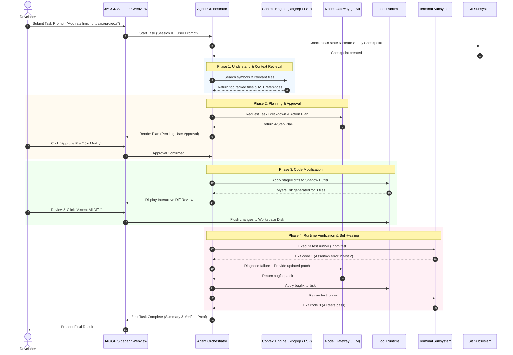

# 04 — JAGGU User Flows & Interaction Lifecycles

## 1. Overview

This document specifies the exact, step-by-step user journeys and system interactions across the 21 primary engineering workflows supported by JAGGU. Every flow is modeled with deterministic transitions, user approval gates, cancellation semantics, and recovery paths.

---

## 2. Master Flow Diagrams

### 2.1 The Autonomous Task Lifecycle

---

## 3. Detailed Specification for All 21 User Flows

### Flow 1: First Launch & Onboarding
1. Developer installs JAGGU extension in VS Code.
2. JAGGU Activity Bar icon appears on the left navigation bar.
3. Clicking the icon opens the JAGGU Welcome View:
   - Brief 3-bullet introduction.
   - Quick provider setup buttons (Anthropic, OpenAI, Gemini, Ollama).
   - "Connect Provider" button.

### Flow 2: Open Repository Detection
1. When a workspace folder is opened, JAGGU's activation event `onStartupFinished` fires.
2. Context engine detects:
   - Repository root path.
   - Project type (`package.json`, `Cargo.toml`, `go.mod`, `pyproject.toml`).
   - Git repository status (initialized or non-git).
3. Status badge in sidebar displays: `Workspace: Ready (Node.js/TypeScript)`.

### Flow 3: Configure AI Provider & API Key
1. Developer clicks the settings gear icon in JAGGU toolbar.
2. Modal input prompt appears (or dedicated settings tab):
   - Choose Model Provider: `[Anthropic / Claude 3.5 Sonnet]` (Default).
   - Input API Key: `sk-ant-...`.
3. Extension writes key securely to VS Code `SecretStorage` (`context.secrets.store`).
4. Key is never logged, never exposed to webviews, and verified with a 1-token heartbeat ping.

### Flow 4: Start Conversation
1. Developer enters natural language intent into the bottom prompt input box.
2. Supports `@file`, `@symbol`, and `@folder` mentions with autocomplete dropdown.
3. Hits `Enter` (or `Cmd+Enter` for multi-line).
4. New conversation session ID is generated and state transitions to `THINKING`.

### Flow 5: Ask Repository Architecture Question (Read-Only)
1. User asks: *"How is user authentication token refreshed in this repo?"*
2. Agent initiates `search_code` and `find_symbol` across files matching `*auth*`, `*token*`.
3. Agent reads snippets from `src/auth/jwt.ts` and `src/middleware/refresh.ts`.
4. Agent streams a direct explanation citing exact line numbers and displays a file link chip.
5. Zero file modifications are generated; agent state returns to `IDLE`.

### Flow 6: Ask Coding Task (Mutating Intent)
1. User asks: *"Create a new endpoint POST /api/v1/health that returns uptime and DB ping."*
2. Agent analyzes router structure, imports, and database client.
3. System classifies intent as `MUTATING_TASK` and transitions to `PLANNING`.

### Flow 7: Agent Creates Implementation Plan
1. Agent streams structured JSON plan payload.
2. UI renders an interactive **Plan Card**:
   - `[ ] Step 1: Create src/controllers/health.ts`
   - `[ ] Step 2: Register route in src/routes/index.ts`
   - `[ ] Step 3: Add unit test in tests/health.test.ts`
   - `[ ] Step 4: Run test suite to verify 200 OK response`
3. Action buttons render: `[Approve Plan]` | `[Edit Plan]` | `[Cancel]`.

### Flow 8: User Approves Plan
1. Developer clicks `[Approve Plan]`.
2. Agent state transitions from `WAITING_FOR_APPROVAL` to `EXECUTING`.
3. Step 1 checkbox switches to a spinning activity indicator.

### Flow 9: Agent Edits Files (Shadow Staging)
1. Agent executes `create_file` for `src/controllers/health.ts`.
2. Agent executes `write_file` with patch for `src/routes/index.ts`.
3. Changes are written to the in-memory **Shadow Buffer** (disk untouched).
4. UI notifies user: `3 files staged for review`.

### Flow 10: User Reviews Diff
1. UI displays the **Diff Review Surface**:
   - Left pane: Original file.
   - Right pane: Agent's proposed file.
   - Color-coded green additions and red deletions.
2. Options available:
   - `Accept Hunk` / `Reject Hunk`.
   - `Accept All Files` / `Discard All`.
3. Once accepted, JAGGU commits changes to actual workspace files on disk.

### Flow 11: Agent Executes Terminal Command
1. Plan reaches Step 4: *"Run test suite"*.
2. Agent requests execution of `npm test tests/health.test.ts`.
3. Because `run_command` is classified as `MODERATE`, JAGGU displays inline command card:
   - `Command: npm test tests/health.test.ts`
   - `Directory: /Users/apple/Desktop/my-project`
4. If "Auto-run safe tests" setting is enabled, proceeds; otherwise awaits single-click confirmation.

### Flow 12: Command Fails (Runtime Error Capture)
1. Pseudo-terminal runs the command; test runner exits with code `1`.
2. Error trace captured: `Error: Cannot find module '../controllers/health'`.
3. Agent detects non-zero exit code and transitions to `DIAGNOSING`.

### Flow 13: Agent Diagnoses Error
1. Agent examines the import path: relative path in route was missing `.js` extension required by ESM.
2. Agent explains in UI: *"The route failed because the project uses ES Modules and requires explicit extension in import."*

### Flow 14: Agent Fixes Code (Self-Healing Step)
1. Agent automatically prepares a corrective patch for `src/routes/index.ts`.
2. Applies corrected import: `import { healthController } from '../controllers/health.js';`.
3. Re-stages the file and informs the user.

### Flow 15: Tests Pass
1. Agent re-executes `npm test tests/health.test.ts`.
2. Output streams in terminal widget: `1 passed, 0 failed, 1 total. Tests passed! Exit code 0.`
3. Step 4 checkbox marks as `[X] Verified`.

### Flow 16: Agent Completes Task
1. Agent transitions to `COMPLETED`.
2. UI displays celebratory success badge with:
   - Total files modified (3).
   - Tests verified (1 pass).
   - Execution time (14.2s).
   - Token usage (3,420 tokens).

### Flow 17: User Cancels Agent (Emergency Abort)
1. At any point during streaming, planning, or execution, user clicks `[Stop / Cancel]` (or presses `Escape`).
2. Immediate actions:
   - LLM HTTP stream is aborted via `AbortController`.
   - Active terminal child process is killed via `SIGTERM` (followed by `SIGKILL` after 500ms).
   - Staged uncommitted shadow changes are discarded.
   - Agent returns to `IDLE` state with message: *"Task cancelled by user."*

### Flow 18: Agent Requests High-Risk Permission
1. Agent determines it needs to delete an obsolete file `src/legacy-auth.ts`.
2. Operation is classified as `HIGH_RISK`.
3. UI blocks execution and displays a high-visibility amber prompt:
   - `DANGER: Agent wants to delete src/legacy-auth.ts.`
   - `[Confirm Delete]` | `[Deny & Skip]`

### Flow 19: Permission Denied
1. User clicks `[Deny & Skip]`.
2. Tool call returns: `{ status: "denied", reason: "User rejected deletion." }`.
3. Agent logs denial, adapts its plan, and refactors without deleting the file.

### Flow 20: Git Diff Review & Working Tree Check
1. User clicks the "Git Status" button in JAGGU toolbar.
2. JAGGU compares working tree against HEAD commit.
3. Renders concise summary of all changes made during the session.
4. Generates an optional semantic commit message: `feat(health): add healthcheck endpoint with uptime stats`.

### Flow 21: Conversation Restoration & History
1. User closes and reopens VS Code.
2. JAGGU loads previous session history from `.vscode/jaggu/sessions.json` (or extension global storage).
3. Chat history, past task plans, and terminal outputs are restored in read-only replay state, ready for follow-up prompts.
